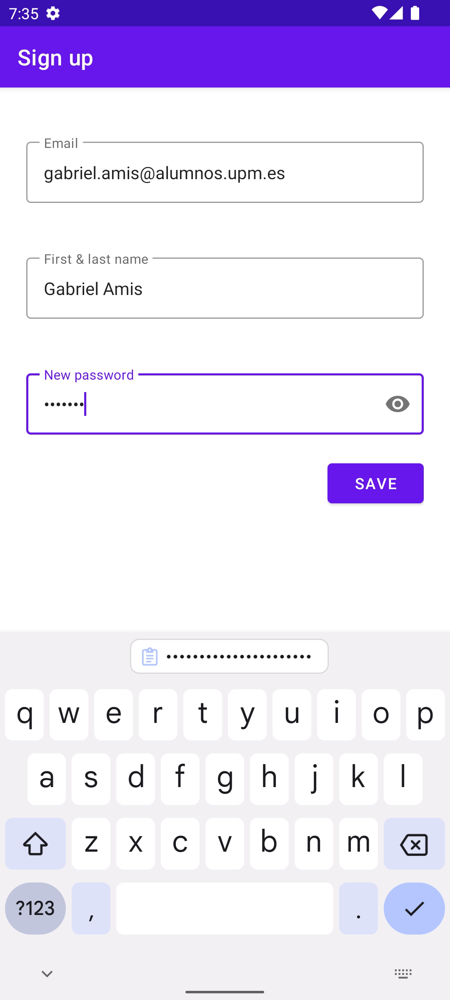
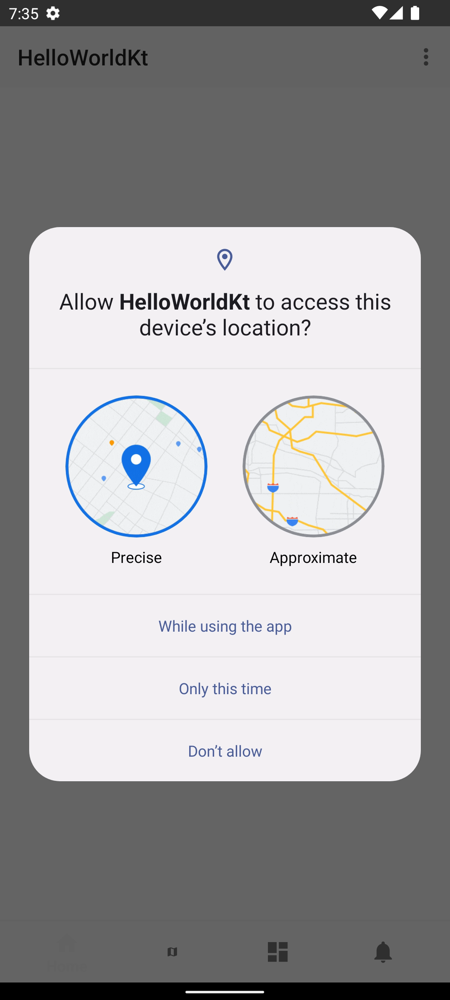
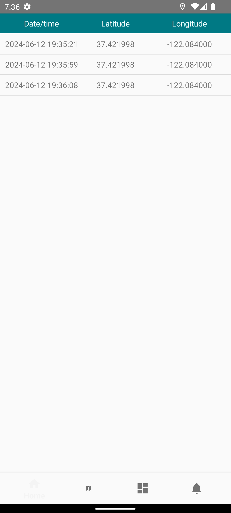
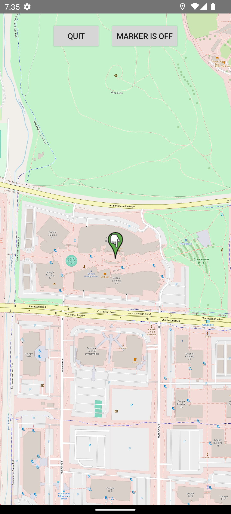
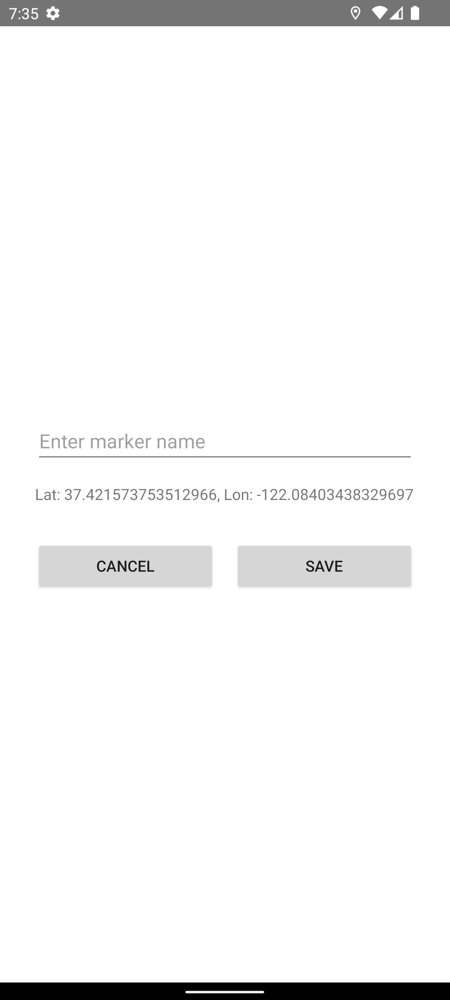
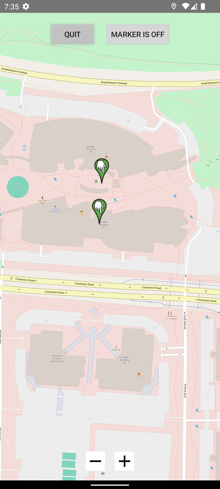

# MADWeather

## Workspace 
Github:  
- Repository: https://github.com/GabrielAmisUPM/MAD
- - Releases: https://github.com/GabrielAmisUPM/MAD/releases  

Workspace: https://upm365.sharepoint.com/sites/mobilappdevelopment/SitePages/Tracking.aspx
  

## Description
Weather map app \
Add point on the map that are saved, real time weather on your location and the marker you added.

## Feature

- Fireship login
- Map
- Persitence data (login)
- CSV Save file for coordinates point
- Navigation menu system
- Toat Message/Text
- API Weather

## Screenshots and navigation
Include screenshots of the app in action. You can upload the images to GitHub and then reference them here using Markdown or HTML syntax:

<table>
  <tr>
    <td>
      
      
Sign Up

    </td>
    <td>
      
      
Permission

    </td>
    <td>
      
      
Some Coordinates saved

    </td>
  </tr>
  <tr>
    <td>
      
      
Map

    </td>
    <td>
      
      
Add a Marker and a saved point

    </td>
    <td>
      
      
New Map after a marker was added

    </td>
  </tr>
</table>

## Demo Video
[Demo Video](https://upm365-my.sharepoint.com/personal/gabriel_amis_alumnos_upm_es/_layouts/15/stream.aspx?id=%2Fpersonal%2Fgabriel%5Famis%5Falumnos%5Fupm%5Fes%2FDocuments%2FMAD%5FKOTLIN%2Ewebm&nav=eyJyZWZlcnJhbEluZm8iOnsicmVmZXJyYWxBcHAiOiJTdHJlYW1XZWJBcHAiLCJyZWZlcnJhbFZpZXciOiJTaGFyZURpYWxvZy1MaW5rIiwicmVmZXJyYWxBcHBQbGF0Zm9ybSI6IldlYiIsInJlZmVycmFsTW9kZSI6InZpZXcifX0&ga=1&referrer=StreamWebApp%2EWeb&referrerScenario=AddressBarCopied%2Eview%2Ec35fe8b7%2Dfb4f%2D493e%2D8bf3%2Dfcb669e32e3a)

## Participants
List of MAD developers:
- Gabriel Amis (gabriel.amis@alumunos.upm.es)
- Maiwenn Foucher (maiwenn.foucher@alumnos.upm.es)

*This project was not fun*
